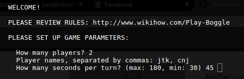
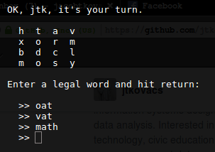
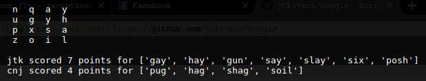

# Boggle

**BOGGLE.ipynb** is commented code; **BOGGLE.py** is the script. Run `python BOGGLE.py` in your shell to play.

Required Python libraries:

- random
- os
- time
- collections
- nltk and then [install words corpora](http://www.nltk.org/data.html)
- urllib.request
- json

## Screenshots

### Defining game parameters

#### Playing a turn

**Displaying final scores:**

